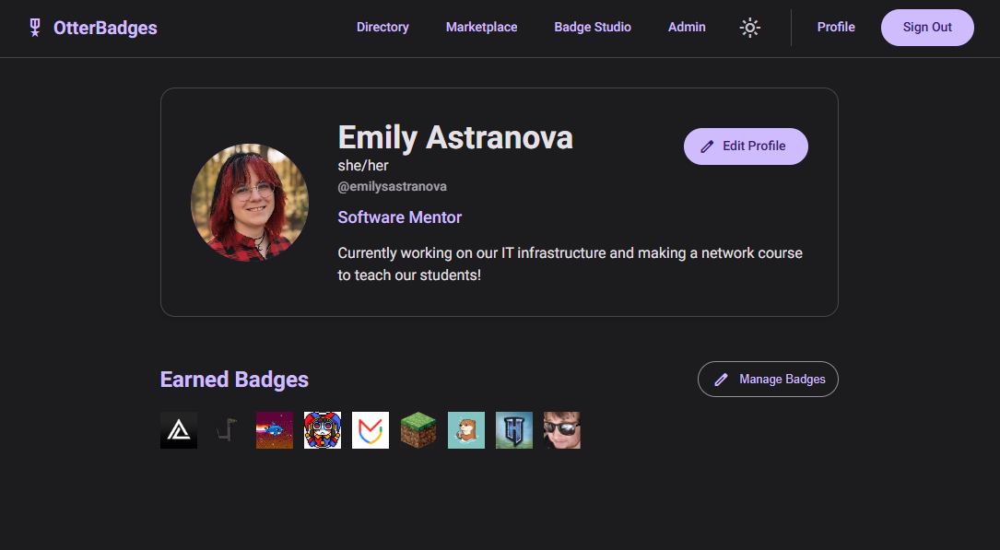

# 🦦 OtterBadges

Create, distribute, and collect digital achievement badges across your organization.



OtterBadges is a self-hosted badge platform built with Next.js and Material Design 3. Design custom badges in the built-in studio, award them to teammates, and showcase your favorites on a personalized profile - complete with dynamic theming.

## Features

- **Badge Studio** — Design badges with a live canvas editor and publish them to the marketplace
- **Marketplace** — Browse and clone public badges created by other users
- **User Profiles** — Customizable profiles with avatars, bios, pronouns, name pronunciation, and per-user Material 3 dynamic color theming
- **Favorite Badges** — Pin up to 5 badges to highlight on your profile and directory listing
- **User Directory** — Searchable directory of all users with their roles and favorite badges
- **User Aliases** — Clean, human-readable profile URLs (e.g. `/u/emilysastranova`) instead of UUIDs
- **Admin Panel** — Full control over users (rename, email, password reset, role management) and badges (edit title/description, delete)
- **Mobile Responsive** — Collapsible navigation drawer, touch-friendly badge descriptions, and adaptive layouts
- **Authentication** — Email/password and Google OAuth via NextAuth.js

## Tech Stack

| Layer | Technology |
|-------|-----------|
| Framework | [Next.js 16](https://nextjs.org/) (App Router, Turbopack) |
| UI Components | [Material Web](https://github.com/nicolo-ribaudo/material-web) (Material Design 3) via `@lit/react` |
| Theming | [material-color-utilities](https://github.com/nicolo-ribaudo/material-color-utilities) for dynamic color |
| Database | SQLite via [better-sqlite3](https://github.com/nicolo-ribaudo/better-sqlite3) |
| ORM | [Prisma](https://www.prisma.io/) with `@prisma/adapter-better-sqlite3` |
| Auth | [NextAuth.js](https://next-auth.js.org/) (JWT strategy) |
| Language | TypeScript, React 19 |

## Getting Started

### Prerequisites

- Node.js 20+
- npm

### Installation

```bash
# Clone the repository
git clone https://github.com/emilyastranova/otterbadges.git
cd otterbadges

# Install dependencies
npm install

# Set up the database
npx prisma db push
npx prisma generate

# Start the dev server
npm run dev
```

The app will be available at [http://localhost:3000](http://localhost:3000).

### Environment Variables

Create a `.env` file in the project root:

```env
DATABASE_URL="file:./dev.db"

# Auth (required for Google OAuth, optional for credentials-only)
GOOGLE_CLIENT_ID="your-google-client-id"
GOOGLE_CLIENT_SECRET="your-google-client-secret"
NEXTAUTH_SECRET="your-secret-here"
NEXTAUTH_URL="http://localhost:3000"

# Application Branding
NEXT_PUBLIC_APP_NAME="OtterBadges"

# Authentication Toggles
NEXT_PUBLIC_DISABLE_SIGNUP="false"       # Set to "true" to disable new user signups via email/password
NEXT_PUBLIC_DISABLE_LOCAL_LOGIN="false"  # Set to "true" to disable email/password login entirely (useful if you only want Google OAuth)
NEXT_PUBLIC_AUTO_SSO="false"             # Set to "true" to automatically redirect users to Google SSO when they land on the login page
```

### Google OAuth Setup (Optional)

To enable the "Sign in with Google" button, you need to set up OAuth credentials in the Google Cloud Console:

1. Go to the [Google Cloud Console](https://console.cloud.google.com/).
2. Create a new project or select an existing one.
3. Navigate to **APIs & Services** > **Credentials**.
4. Click **Create Credentials** > **OAuth client ID**.
5. Select **Web application** as the application type.
6. Under **Authorized redirect URIs**, add exactly:
   ```
   http://localhost:3000/api/auth/callback/google
   ```
   *(Note: For production, replace `http://localhost:3000` with your actual domain).*
7. Copy the generated **Client ID** and **Client Secret**.
8. Paste them into your `.env` file as `GOOGLE_CLIENT_ID` and `GOOGLE_CLIENT_SECRET`.

## Project Structure

```
src/
├── app/
│   ├── admin/          # Admin control panel
│   ├── api/            # API routes (auth, badges, users, admin)
│   ├── directory/      # User directory page
│   ├── login/          # Sign in / sign up
│   ├── marketplace/    # Public badge marketplace
│   ├── studio/         # Badge creation studio
│   └── u/[id]/         # User profile pages
├── components/         # Shared components (NavBar, MaterialUI wrappers, FeedbackDialog)
├── lib/                # Prisma client, auth config, utilities
└── types/              # TypeScript type augmentations
prisma/
└── schema.prisma       # Database schema
```

## Admin Setup

To grant admin privileges to a user, update their role directly in the database:

```bash
sqlite3 dev.db "UPDATE User SET role = 'ADMIN' WHERE alias = 'youralias';"
```

Admins see an **Admin** link in the navigation bar and can access `/admin` to manage all users and badges.

## License

This project is licensed under the [MIT License](LICENSE).
